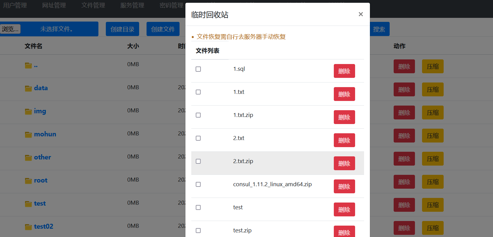
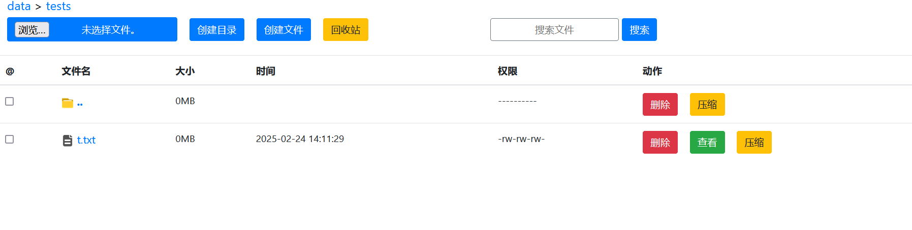
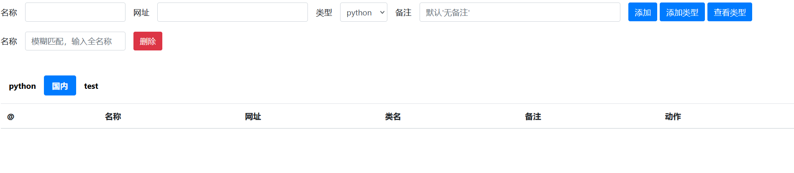

# guide 公司内部系统集合工具
## 不要公网使用，尽管有白名单功能，但是安全模块代码没细写，只是简单的写了点。只支持内网使用。开发小白，代码有点拉，望见谅。

guide是一个内部集合工具,故而没有权限管理(开发中...)。只是简单的实现了下白名单功能，guide支持系统url管理，文件管理(支持多文件上传，下载文件，在线文件查看，在线删除(可批量)文件及目录，在线创建文件和目录，在线编辑更新，在线压缩，在线解压(目前只实现了4种解压格式[.gz, .tar.gz, .tar, .zip]))，普通定时任务执行,项目及工具启动命令记录，密码管理。

```
服务变量说明:
    GUIDE_KEY 加密字符串
    GUIDE_DIR_ACCESS_PWD  特殊目录查看密码设置
```

linux run:

```shell
export GUIDE_KEY=xxxxxxxxxxxxxxxx GUIDE_DIR_ACCESS_PWD=xxxxxx && ./guide
访问: 浏览器直接访问ip+端口即可

```

win run:

```shell
set GUIDE_KEY=xxxxxxxxxxxxxxxx GUIDE_DIR_ACCESS_PWD=xxxxxx
./guide.exe

```






