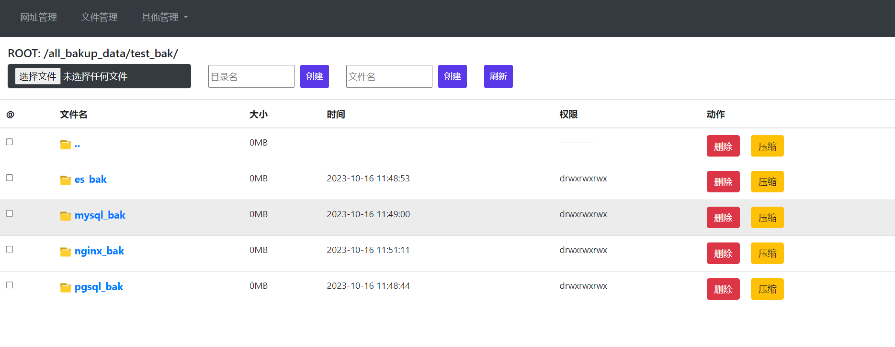
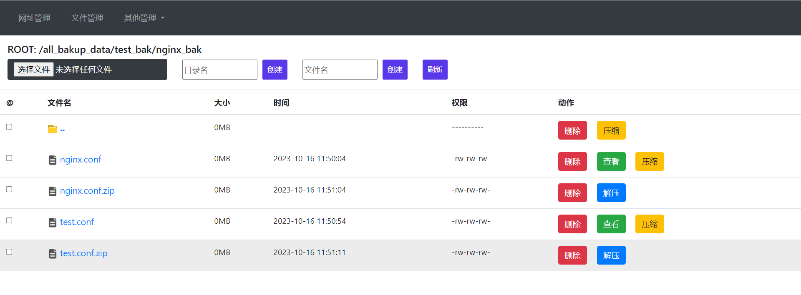

# guide 公司内部系统集合工具
## 不要公网使用，尽管有白名单功能，但是安全模块代码没细写，只是简单的写了点。只支持内网使用。

guide是一个内部集合工具,故而没有支持登录和权限管理等。只是简单的实现了下白名单功能，guide支持系统url管理，文件管理(支持多文件上传，下载文件，在线文件查看，在线删除(可批量)文件及目录，在线创建文件和目录，在线压缩，在线解压(目前只实现了4种解压格式[.gz, .tar.gz, .tar, .zip]))，普通定时任务执行,项目及工具启动命令记录，其他正在开发中^_^

```
服务变量说明:
    GUIDE_HOST 监听的ip地址
    GUIDE_PORT 监听的端口
    GUIDE_FILEDATA_DIR 文件系统根路径
    #GUIDE_INTERFACE_NAME 监听网卡名
    GUIDE_WHITE_LIST 访问白名单列表,多个ip以逗号分隔(127.0.0.1,192.168.100.101)
    GUIDE_START_WHITE_LIST 是否开启白名单(false/true)
```

linux run:

```shell
export GUIDE_HOST=0.0.0.0 GUIDE_PORT=7878 GUIDE_FILEDATA_DIR=/opt GUIDE_WHITE_LIST=127.0.0.1 GUIDE_START_WHITE_LIST=true && ./guide
访问: 浏览器直接访问ip+端口即可

```

win run:

```shell
set GUIDE_HOST=0.0.0.0 GUIDE_PORT=7878 GUIDE_FILEDATA_DIR=D:\tmp GUIDE_WHITE_LIST=127.0.0.1 GUIDE_START_WHITE_LIST=true
./guide.exe

```





